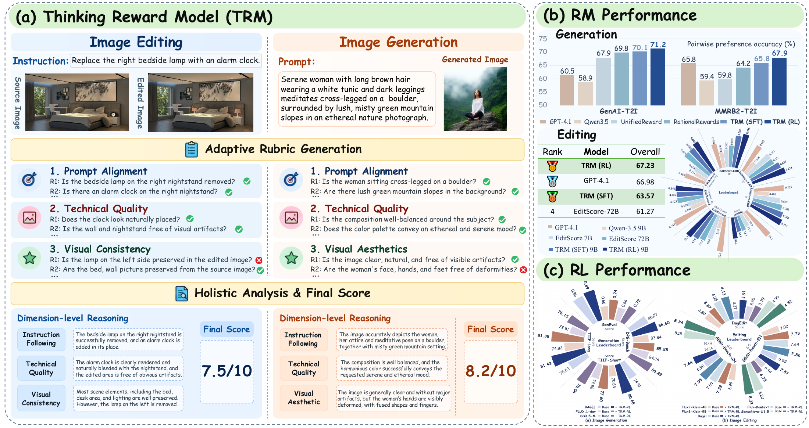
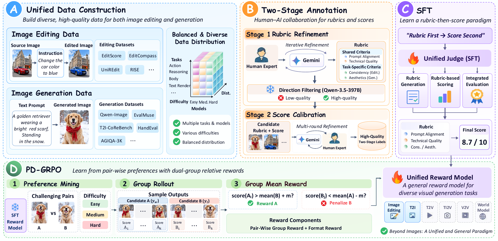
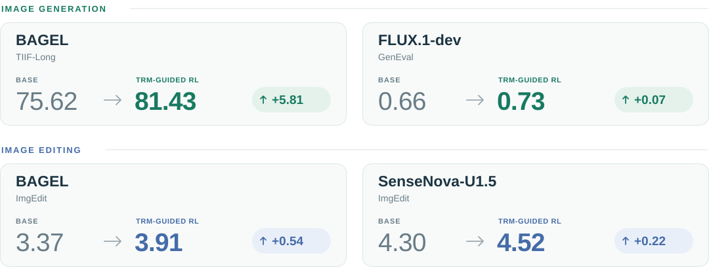
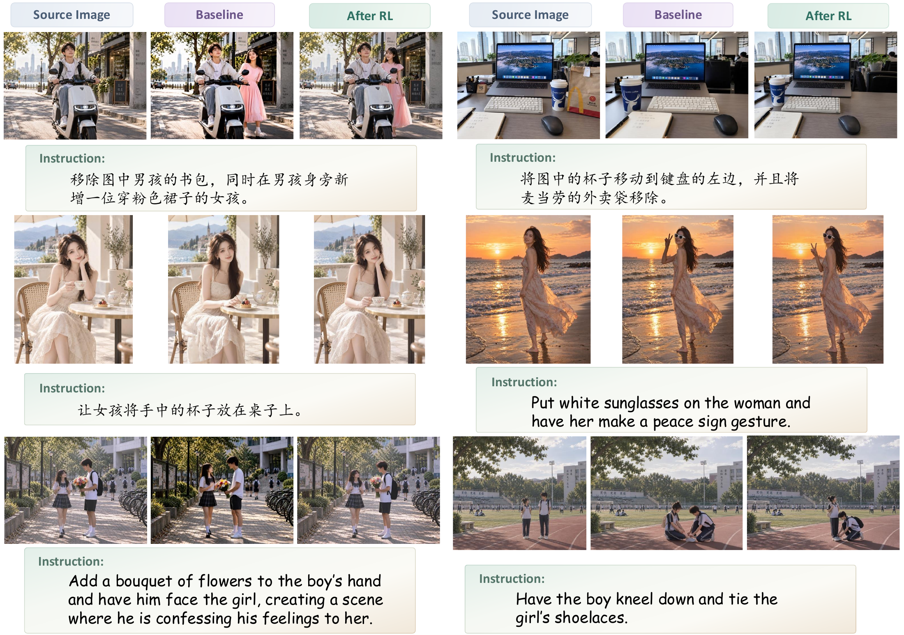

<div align="center">

<picture>
  <source media="(prefers-color-scheme: dark)" srcset="assets/trm-title-dark.svg">
  
</picture>

<sub>Xuehai Bai<sup>\*</sup> · Zhenchen Tang<sup>\*</sup> · Yang Shi<sup>\*,♠</sup> · Dianyi Wang · Tengfei Liu · Wanshun Su<br>
Xuanyu Zhu · Ruohui Wang · Haiwen Diao · Haotian Wang<sup>†</sup> · Xiaoling Gu<sup>†</sup> · Yuanxing Zhang</sub>

<sub>HDU · CASIA · PKU · SenseTime · FDU · NWPU · NTU · THU</sub><br>
<sub><sup>\*</sup> Equal contribution &nbsp; <sup>♠</sup> Project Lead &nbsp; <sup>†</sup> Corresponding authors</sub>

<p>
  <a href="https://arxiv.org/abs/2609.37372"></a>
  &nbsp;
  <a href="https://huggingface.co/collections/asdjghh/thinking-reward-model"></a>
  &nbsp;
  <a href="https://bxhsort.github.io/Thinking-Reward-Model/"></a>
</p>

[News](#-news) · [Overview](#overview) · [Results](#results) · [Quick Start](#quick-start) · [Models](#models)



<sub>One evaluation paradigm for image generation and editing: case-adaptive rubrics → structured assessment → pointwise reward.</sub>

</div>

## 🔥 News

- `2026/09` 🌟 Inference code for **TRM-Edit** and **TRM-T2I** is available in this repository, with **Transformers** and **vLLM** support.
- `2026/09` 🤗 Explore the **Thinking Reward Model** collection on [Hugging Face](https://huggingface.co/collections/asdjghh/thinking-reward-model).

## Overview

**TRM** is a 9B visual reward model built on Qwen3.5-9B. Given a generation or editing case, it first determines **what to evaluate**, inspects the candidate against those criteria, and produces an interpretable evaluation with a fine-grained reward.

- **Case-adaptive rubrics.** Evaluation points are tailored to the prompt, candidate image, and source image when applicable.
- **Structured judgments.** Rubric-level checks and dimension-level explanations accompany a final score on a 0–10 scale.
- **Preference learning without persistent score-gap expansion.** Cold-start SFT is followed by **Pairwise Dual-Group Relative Policy Optimization (PD-GRPO)**, which stops rewarding further separation once the required margin is met.

<details>
<summary><b>How TRM is trained</b></summary>

The paper constructs approximately **20K image-generation cases** and **28K image-editing cases** with structured rubric-and-score annotations. Cold-start SFT teaches rubric generation, rubric-based scoring, and integrated evaluation; PD-GRPO then introduces pairwise supervision while preserving independent pointwise scoring at inference.



Training and benchmark-evaluation pipelines are described in the paper; this repository contains the inference implementation.

</details>

## Results

Selected results from the accompanying manuscript. All three rows use a **9B** backbone; the baseline is the original Qwen3.5-9B evaluated with the same pointwise protocol.

| Model | GenAI-T2I<br>(%) ↑ | MMRB2-T2I<br>(%) ↑ | EditScore-ERB<br>(O) ↑ | EditReward-ERB<br>(2-path, %) ↑ |
| :--- | ---: | ---: | ---: | ---: |
| Qwen3.5-9B baseline | 58.9 | 59.4 | 0.401 | 33.8 |
| TRM (SFT) | 70.1 | 65.8 | 0.743 | 67.8 |
| **TRM (RL)** | **71.2** | **67.9** | **0.773** | **71.3** |

<sub>GenAI-T2I and MMRB2-T2I report pairwise preference accuracy on non-tied predictions, following the main-paper protocol. Tie-aware TRM (RL) accuracy is 68.4% and 63.9%, respectively; see the paper appendix for the full protocol.</sub>

### Better rewards, better visual generation

Representative gains from TRM-guided reinforcement learning across image generation and editing models.

<picture>
  <source media="(max-width: 600px) and (prefers-color-scheme: dark)" srcset="assets/trm-rl-results-mobile-dark.svg">
  <source media="(max-width: 600px)" srcset="assets/trm-rl-results-mobile-light.svg">
  <source media="(prefers-color-scheme: dark)" srcset="assets/trm-rl-results-dark.svg">
  
</picture>

<sub>Base → TRM-guided RL. Gains are absolute score changes on each benchmark's original scale.</sub>

<details>
<summary><b>Visual comparisons: before and after TRM-guided RL</b></summary>



Qualitative examples from the paper show improved instruction following and preservation of unedited content with SenseNova-U1.5.

</details>

## Quick Start

### 1. Install

```bash
git clone https://github.com/bxhsort/Thinking_Reward_Model.git
cd Thinking_Reward_Model

conda create -n trm python=3.12 -y
conda activate trm
pip install -U pip
pip install -r requirements.txt
pip install -e .
```

### 2. Select a checkpoint

Set the appropriate variable to your local checkpoint directory. See [Models](#models) for checkpoint availability.

```bash
export TRM_EDIT_MODEL=/path/to/trm-edit
export TRM_T2I_MODEL=/path/to/trm-t2i
```

### 3. Score an image

**Image editing**

```bash
CUDA_VISIBLE_DEVICES=0 python scripts/infer_edit.py \
  --model "$TRM_EDIT_MODEL" \
  --source-image /path/to/source.png \
  --edited-image /path/to/edited.png \
  --instruction "Replace the red car with a blue car."
```

**Text-to-image generation**

```bash
CUDA_VISIBLE_DEVICES=0 python scripts/infer_t2i.py \
  --model "$TRM_T2I_MODEL" \
  --image /path/to/generated.png \
  --prompt "A photo of a yellow bus parked under a rainy neon street."
```

Both commands default to **Transformers**, a single GPU, and `temperature=0`. The optional chat-template thinking mode is disabled by default; TRM still generates its structured rubric and assessment. Use `--enable-thinking` only when you intend to enable that additional mode.

### Read the output

Single-image inference prints JSON. The following is a shortened example; rubric entries and explanations are omitted for readability.

```json
{
  "reward": 0.83,
  "final_score": 8.3,
  "parsed": {
    "eval_points": [],
    "dimension_summary": {},
    "score_reason": "...",
    "final_score": 8.3
  },
  "raw_output": "..."
}
```

| Field | Meaning |
| :--- | :--- |
| `reward` | Normalized reward in **[0, 1]**, computed as `final_score / 10` |
| `final_score` | Parsed score clamped to **[0, 10]**; higher is better |
| `parsed` | The model's structured rubric, judgments, dimension summaries, and score explanation |
| `raw_output` | The original generated text |

The vLLM backend also returns `response_id`.

## Models

| Model | Backbone | Checkpoint configuration |
| :--- | :--- | :--- |
| **TRM-Edit** | Qwen3.5-9B | `TRM_EDIT_MODEL` |
| **TRM-T2I** | Qwen3.5-9B | `TRM_T2I_MODEL` |

Browse the [Thinking Reward Model collection on Hugging Face](https://huggingface.co/collections/asdjghh/thinking-reward-model) for TRM resources. Use local checkpoint paths with the inference commands above.

## vLLM Serving

Use vLLM for server-based inference, tensor parallelism, and concurrent batch scoring. Start one server per model; the examples below use separate ports so both can run at the same time when sufficient GPUs are available.

<details>
<summary><b>Serve TRM-Edit</b></summary>

```bash
MODEL_PATH="$TRM_EDIT_MODEL" \
SERVED_MODEL_NAME=trm-edit-reward \
HOST=127.0.0.1 \
PORT=8000 \
IMAGE_LIMIT=2 \
TENSOR_PARALLEL_SIZE=1 \
MAX_MODEL_LEN=32768 \
VLLM_EXTRA_ARGS="--gdn-prefill-backend triton" \
bash scripts/serve_vllm.sh
```

In another terminal:

```bash
python scripts/infer_edit.py \
  --backend vllm \
  --base-url http://localhost:8000 \
  --model trm-edit-reward \
  --source-image /path/to/source.png \
  --edited-image /path/to/edited.png \
  --instruction "Replace the red car with a blue car."
```

</details>

<details>
<summary><b>Serve TRM-T2I</b></summary>

```bash
MODEL_PATH="$TRM_T2I_MODEL" \
SERVED_MODEL_NAME=trm-t2i-reward \
HOST=127.0.0.1 \
PORT=8001 \
IMAGE_LIMIT=1 \
TENSOR_PARALLEL_SIZE=2 \
MAX_MODEL_LEN=16384 \
VLLM_EXTRA_ARGS="--gdn-prefill-backend triton" \
bash scripts/serve_vllm.sh
```

In another terminal:

```bash
python scripts/infer_t2i.py \
  --backend vllm \
  --base-url http://localhost:8001 \
  --model trm-t2i-reward \
  --image /path/to/generated.png \
  --prompt "A photo of a yellow bus parked under a rainy neon street."
```

</details>

Adjust `TENSOR_PARALLEL_SIZE` for your available GPUs. When running both servers, use `CUDA_VISIBLE_DEVICES` to assign a separate GPU set to each.

## Batch Scoring

Batch JSONL inference requires a running **vLLM** server. Each line describes one request. Image paths are read on the client machine, relative to its working directory unless absolute paths are provided.

<details>
<summary><b>Image editing: JSONL format and batch command</b></summary>

Create `data/edit_requests.jsonl` with one record per line:

```json
{"source_image": "/path/to/source.png", "edited_image": "/path/to/edited.png", "instruction": "Make the sky cloudy."}
```

```bash
mkdir -p outputs
python scripts/infer_edit.py \
  --backend vllm \
  --base-url http://localhost:8000 \
  --model trm-edit-reward \
  --input-jsonl data/edit_requests.jsonl \
  --output-jsonl outputs/edit_scores.jsonl \
  --workers 16
```

</details>

<details>
<summary><b>Text-to-image: JSONL format and batch command</b></summary>

Create `data/t2i_requests.jsonl` with one record per line:

```json
{"image": "/path/to/generated.png", "prompt": "A photo of a yellow bus."}
```

```bash
mkdir -p outputs
python scripts/infer_t2i.py \
  --backend vllm \
  --base-url http://localhost:8001 \
  --model trm-t2i-reward \
  --input-jsonl data/t2i_requests.jsonl \
  --output-jsonl outputs/t2i_scores.jsonl \
  --workers 16
```

</details>

## License

The code is released under the [MIT License](LICENSE). Model weights are subject to the license accompanying each checkpoint.
